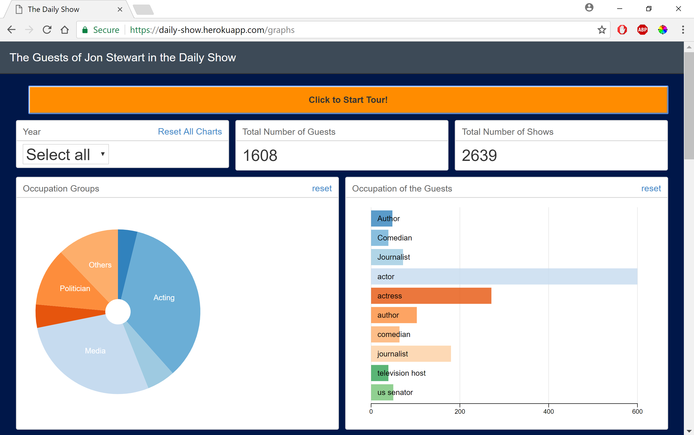

# The Guests Of Jon Stewart Data Visualisation

http://daily-show.herokuapp.com/

## Overview

A visual representation of data about the guests of Jon Stewart in The Daily Show. The data is represented in the form of interactive charts

## Features

- Pie chart - showing the different occupation groups
- Row charts - one row chart to show the top ten occupations of the guests, another row chart to show the top ten guests
- Line chart - showing how the number of guests have changed over the years
- Series chart - showing how the 3 top occupation groups have changed over the years. The only chart on the website which is not interacting with the others charts.
- Data table - will display the relevant data by selecting a guest or a show

## Tech Used

- [MongoDB](https://www.mongodb.com/): an open-source database using document-orientated data model
	- We use **MongoDB** to convert and present our data in JSON format
	
- [Flask](http://flask.pocoo.org/): a Python based microframework
	- We use **Flask** to serve our data from the server to our web based interface

- [Bootstrap](http://getbootstrap.com/): a HTML, CSS and JS framework for building responsive, mobile-first websites
	- We use **bootstrap** to make our site responsive
	
- [D3.js](https://d3js.org/): a JavaScript library for manipulating data
	- We use **D3.js** to render our interactive charts and graphs
	
- [Dc.js](https://dc-js.github.io/dc.js/): a JavaScript library for data visualization 
	- We use **Dc.js** to plot the charts
	
- [Crossfilter.js](http://square.github.io/crossfilter/): a JavaScript library for manipulating data	
	
- [Queue.js](https://github.com/d3/d3-queue): an asynchronous helper library for JavaScript
	
## The database

My project used the database [daily-show-guests](https://github.com/fivethirtyeight/data/tree/master/daily-show-guests) presented by [FiveThirtyEight](http://fivethirtyeight.com/) at https://github.com/fivethirtyeight/data under the [Creative Commons Attribution 4.0 International License](https://creativecommons.org/licenses/by/4.0/).
I made the following changes to the database to make my charts as accurate as possible
- corrected minor typographical errors, e.g. extra apostrophe, extra white space, spelling mistakes etc.
- changed rows that contained 2 or more guests to rows containing only a single guest e.g. "Adam Sandler and Chris Rock" occured in two rows under the Guest column, indicating that the specific show featured these two guests. I modified these two rows to include "Adam Sandler" and "Chris Rock" separately on each row
- some guests' names included a title in a few instances, while no title in others - I removed the title, so my charts can show more accurate information
- some guests' names included extra information e.g. "David Cross (show hosted by Stephen Colbert)" - removed the extra information

